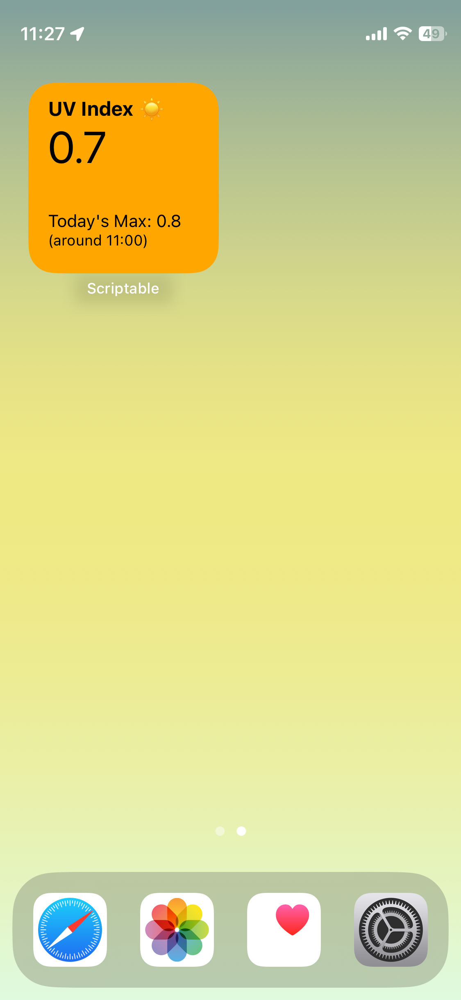
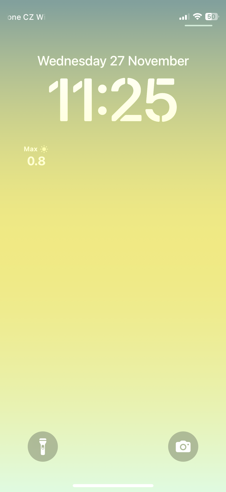

# UV index Scriptable widgets

You can find both home screen and lock screen widgets for
[Scriptable](https://scriptable.app/) in this repository.

## Screenshots

  
  

## Installation

Download this repository and put all JavaScript files from the `/src/` folder to
your Scriptable folder. If you have iCloud installed on your computer, you can
do it from there. Otherwise, you need to do it on your iPhone using the Files
app.

Then you need to edit `secrets.js` file and put your OpenWeatherMap API key. To
edit the file you can use any text editor. If you are on your iPhone, you can
use the Scriptable app (move the file to the Scriptable folder first). To get
the API key, you need to create a free account on
[OpenWeatherMap](https://openweathermap.org/). 1,000 API calls per day are free,
so that should be more than enough.

Then you are ready to add the widget to your home screen.
